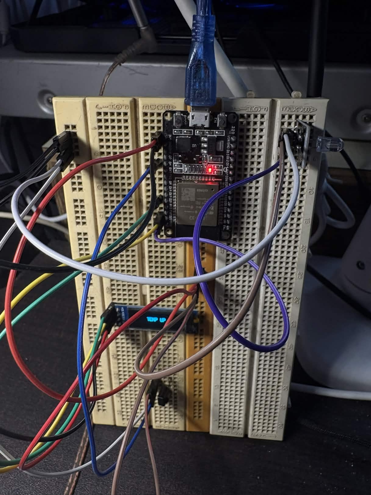
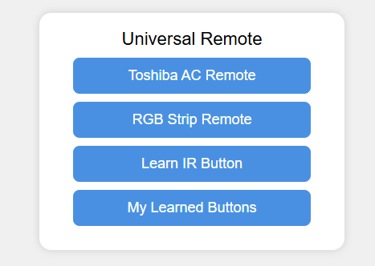
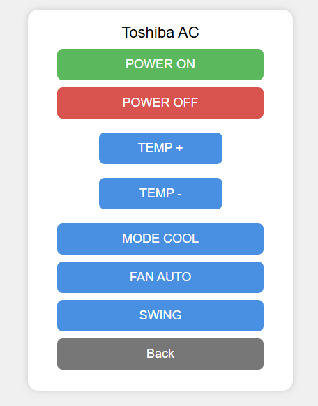

# Universal IR

This project implements a universal IR control based on an ESP32 microcontroller.

## ESP32 Modules Used

-  **TSOP1738** – Desoldered this out of an old AMP that is no longer used.
- **KY-005 38KHz Infrared IR Transmitter Sensor**

## Supported Devices

As of now the firmware only supports:

- Toshiba air conditioners
- Generic Chinese 24-button RGB LED controllers

## Images

  
  

